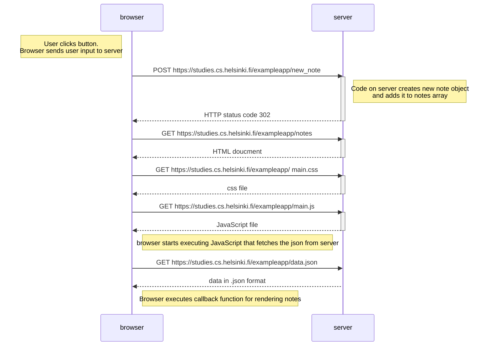

# New note diagram

```mermaid
sequenceDiagram
    participant browser
    participant server

    Note left of browser: User clicks button. <br> Browser sends user input to server
    browser->> server: POST https://studies.cs.helsinki.fi/exampleapp/new_note
    activate server
    Note right of server: Code on server creates new note object <br> and adds it to notes array
    server-->>browser: HTTP status code 302
    deactivate server

    browser->>server: GET https://studies.cs.helsinki.fi/exampleapp/notes
    activate server
    server-->>browser: HTML doucment
    deactivate server

    browser->>server: GET https://studies.cs.helsinki.fi/exampleapp/ main.css
    activate server
    server-->>browser: css file
    deactivate server

    browser->>server: GET https://studies.cs.helsinki.fi/exampleapp/main.js
    activate server
    server-->>browser: JavaScript file
    deactivate server

    Note right of browser: browser starts executing JavaScript that fetches the json from server

    browser->>server: GET https://studies.cs.helsinki.fi/exampleapp/data.json
    activate server
    server-->>browser: data in .json format

    Note right of browser: Browser executes callback function for rendering notes

```
